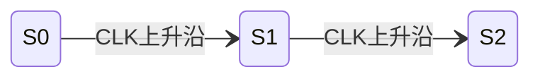

# 822电子技术基础 - 电路图解析

## 技能概述

本技能提供822电子技术基础的电路图智能解析功能：

1. **电路图识别**：使用MCP工具识别电路结构
2. **元件参数提取**：提取电阻、电容、晶体管、运放等参数
3. **电路拓扑分析**：分析连接关系、信号流向
4. **静态分析输出**：计算直流工作点
5. **动态分析输出**：计算增益、输入输出电阻
6. **康华光符号体系强制**：严格使用指定教材符号

**设计原则**：
- 优先使用MCP工具进行电路图识别
- 输出必须使用康华光符号体系
- 静态分析和动态分析分开进行

---

## 触发条件

### 触发此技能当：

**电路图分析**：
- "电路图"、"分析电路"、"帮我看看这个电路"
- "静态分析"、"动态分析"
- "计算工作点"、"计算增益"

**上传电路图**：
- 用户上传电路图截图
- 用户描述电路结构

### 不触发此技能当：
- 解题步骤/SOP → 使用 kaoyan-electronics-sop
- 查询知识点结构 → 使用 kaoyan-electronics-structure
- 配置/状态检查 → 使用 kaoyan-electronics-core

---

## 支持的输入方式

1. **电路图截图**：上传电路图图片
2. **文字描述**：用文字描述电路结构

---

## 处理流程

```
【电路图截图/文字描述】
      ↓
【MCP工具识别】
  - understand_technical_diagram（识别电路结构）
  - extract_text_from_screenshot（提取元件参数）
      ↓
【提取元件信息】
  - 电阻、电容、晶体管、运放等
      ↓
【分析电路拓扑】
  - 连接关系、信号流向
      ↓
【选择对应SOP】
  - 根据电路类型选择标准流程
      ↓
【生成结构化笔记】
  - 静态分析 + 动态分析
```

---

## 模电电路分析标准流程

### 1. 静态分析

计算直流工作点：

**BJT电路**：
- $I_{BQ}$：基极静态电流
- $I_{CQ}$：集电极静态电流
- $U_{CEQ}$：集射极静态电压

**FET电路**：
- $I_D$：漏极电流
- $U_{GS}$：栅源电压
- $U_{DS}$：漏源电压

### 2. 动态分析

画微变等效电路：

- 计算增益 $A_u = \frac{U_o}{U_i}$
- 计算输入电阻 $R_i$
- 计算输出电阻 $R_o$

### 3. 频率响应

分析$f_L$、$f_H$、$BW$

---

## 数电电路分析标准流程

### 1. 组合逻辑

- 写逻辑表达式
- 卡诺图化简
- 画逻辑图
- 功能扩展

### 2. 时序逻辑

- 写驱动方程
- 写状态方程
- 画状态转换图
- 分析自启动

---

## 输出格式标准

### 模电电路分析输出

```markdown
# [电路类型]分析

## 电路识别
- 类型：[电路类型]
- 元件：[元件列表及参数]

## 静态分析
$$
I_{BQ} = \frac{V_{CC} - U_{BEQ}}{R_b} = ...
$$
$$
I_{CQ} = \beta I_{BQ} = ...
$$
$$
U_{CEQ} = V_{CC} - I_{CQ} R_c = ...
$$

## 动态分析
$$
r_{be} = r_{bb'} + (1+\beta)\frac{26}{I_{EQ}} = ...
$$
$$
A_u = -\frac{\beta R'_L}{r_{be}} = ...
$$
$$
R_i = R_b // r_{be} = ...
$$
$$
R_o = R_c = ...
$$

## 频率响应/自启动检查
[相应分析]

## 结论
[结论与要点]
```

### 数电电路分析输出

```markdown
# [电路类型]分析

## 电路识别
- 类型：[电路类型]
- 触发器类型/数量：[...]
- 输入输出：[...]

## 驱动方程
$$
J_1 = f_1(X, Q), \quad K_1 = g_1(X, Q)
$$

## 状态方程
$$
Q_1^{n+1} = J_1Q_1^n + \overline{K_1}Q_1^n
$$

## 输出方程
$$
Y = f(Q^n, X)
$$

## 状态转换表
| $X$ | $Q_2^n Q_1^n$ | $Q_2^{n+1} Q_1^{n+1}$ | $Y$ |
|-----|--------------|---------------------|-----|
| 0 | 00 | ... | ... |

## 状态转换图


## 自启动检查
[无效状态分析]

## 结论
[功能描述]
```

---

## 康华光符号体系强制

> ⚠️ **重要**: 所有输出必须使用康华光《电子技术基础》（第7版）符号体系

### 静态工作点符号

| 符号 | 含义 | LaTeX |
|------|------|-------|
| $I_{BQ}$ | 基极静态电流 | `I_{BQ}` |
| $I_{CQ}$ | 集电极静态电流 | `I_{CQ}` |
| $U_{CEQ}$ | 集射极静态电压 | `U_{CEQ}` |
| $U_{BEQ}$ | 基射极静态电压 | `U_{BEQ}` |

### 动态参数符号

| 符号 | 含义 | LaTeX |
|------|------|-------|
| $r_{be}$ | BJT输入电阻 | `r_{be}` |
| $r_{ce}$ | BJT输出电阻 | `r_{ce}` |
| $g_m$ | 场效应管跨导 | `g_m` |

### FET参数符号

| 符号 | 含义 | LaTeX |
|------|------|-------|
| $U_{GS(off)}$ | 夹断电压 | `U_{GS(off)}` |
| $U_{GS(th)}$ | 开启电压 | `U_{GS(th)}` |
| $I_{DSS}$ | 饱和漏极电流 | `I_{DSS}` |

### 与其他教材的区别

| 康华光 | 其他教材 | 说明 |
|--------|----------|------|
| $r_{be}$ | $h_{ie}$ | BJT输入电阻 |
| $U_{GS(off)}$ | $U_P$ | 夹断电压 |
| $U_{GS(th)}$ | $U_T$ | 开启电压 |
| $I_{BQ}$ | $I_B$ | 静态基极电流（Q下标） |

---

## 使用示例

### 示例1: 共射放大电路分析

**用户输入**:
```
[上传共射放大电路截图]
帮我分析这个电路
```

**AI处理**:
1. 使用 `understand_technical_diagram` 识别电路结构
2. 使用 `extract_text_from_screenshot` 提取元件参数
3. 按SOP步骤分析静态、动态

**AI输出**:
```markdown
# 共射放大电路分析

## 电路识别
- 类型：共射放大电路
- 元件：$R_b=200k\Omega$, $R_c=3k\Omega$, $V_{CC}=12V$, $\beta=50$

## 静态分析
$$
I_{BQ} = \frac{12 - 0.7}{200} = 56.5\mu A
$$
$$
I_{CQ} = 50 \times 56.5\mu A = 2.83mA
$$
$$
U_{CEQ} = 12 - 2.83 \times 3 = 3.51V
$$

## 动态分析
$$
r_{be} = 300 + (1+50)\frac{26}{2.83} = 0.77k\Omega
$$
$$
A_u = -\frac{50 \times 3//3}{0.77} = -97.4
$$
$$
R_i = 200//0.77 \approx 0.77k\Omega
$$
$$
R_o = 3k\Omega
$$

## 结论
该电路工作在放大区，电压放大倍数约-97.4，信号反相。
```

### 示例2: 计数器分析

**用户输入**:
```
[上传计数器电路图]
分析这个时序逻辑电路
```

**AI处理**:
1. 识别触发器类型和数量
2. 写驱动方程和状态方程
3. 画状态转换图
4. 检查自启动

---

## 验证标准

1. ✅ 能够识别电路图结构
2. ✅ 能够提取元件参数
3. ✅ 能够正确选择SOP
4. ✅ 能够输出康华光符号体系格式
5. ✅ 静态分析和动态分析完整
6. ✅ 结论准确

---

## 技能集成

### 依赖技能

| 技能 | 用途 |
|------|------|
| kaoyan-electronics-sop | 选择对应SOP模板 |
| kaoyan-electronics-core | 错误记录 |
| kaoyan-electronics-structure | 知识点关联 |

### MCP工具

| 工具 | 用途 |
|------|------|
| `understand_technical_diagram` | 识别电路结构 |
| `extract_text_from_screenshot` | 提取元件参数 |

---

*创建日期: 2026-03-12*
*版本: 1.0.0*
