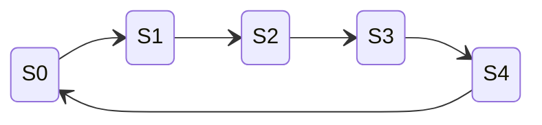

# 822电子技术基础 - SOP模板库

## 技能概述

本技能提供822电子技术基础的标准化解题流程（SOP），包含：

1. **模电SOP（8个）**：共射放大、共集/共基、负反馈判断、差分放大、运算电路、功率放大、波形产生、稳压电源
2. **数电SOP（9个）**：逻辑化简、组合逻辑分析/设计、时序逻辑分析/设计、计数器分析/设计、移位寄存器、ADC/DAC
3. **康华光符号体系**：严格遵循指定教材符号
4. **LaTeX电子符号标准**：标准化公式输出
5. **Mermaid波形图**：时序图、状态图生成

**设计原则**：
- 每个SOP包含完整解题步骤和检查清单
- 强制使用康华光教材符号体系
- 支持Mermaid波形图在Obsidian中渲染

---

## 触发条件

### 触发此技能当：

**解题步骤相关**：
- "怎么做"、"解题步骤"、"SOP"
- "反馈类型判断"、"计数器设计"
- "卡诺图化简"、"时序逻辑分析"

**模电题型**：
- "共射放大"、"负反馈"、"运算电路"
- "差分放大"、"功率放大"、"波形产生"
- "稳压电源"

**数电题型**：
- "逻辑化简"、"组合逻辑"、"时序逻辑"
- "计数器"、"移位寄存器"、"ADC"、"DAC"

### 不触发此技能当：
- 分析电路图 → 使用 kaoyan-electronics-circuit
- 查询知识点结构 → 使用 kaoyan-electronics-structure
- 配置/状态检查 → 使用 kaoyan-electronics-core

---

## SOP快速索引

| SOP编号 | 名称 | 类型 | 触发关键词 |
|---------|------|------|------------|
| SOP1 | 共射放大电路分析 | 模电 | 共射、放大电路、$A_u$ |
| SOP2 | 共集/共基分析 | 模电 | 射极跟随器、共基 |
| SOP3 | 负反馈类型判断 | 模电 | 反馈类型、深度负反馈 |
| SOP4 | 差分放大电路分析 | 模电 | 差分、共模抑制比 |
| SOP5 | 运算电路分析 | 模电 | 运放、虚短虚断 |
| SOP6 | 功率放大电路分析 | 模电 | 功放、效率、OCL |
| SOP7 | 波形产生电路分析 | 模电 | 振荡器、起振条件 |
| SOP8 | 稳压电源分析 | 模电 | 稳压电源、整流滤波 |
| SOP9 | 逻辑函数化简 | 数电 | 卡诺图、化简 |
| SOP10 | 组合逻辑电路分析 | 数电 | 分析组合逻辑 |
| SOP11 | 组合逻辑电路设计 | 数电 | 设计组合逻辑 |
| SOP12 | 时序逻辑电路分析 | 数电 | 分析时序逻辑 |
| SOP13 | 时序逻辑电路设计 | 数电 | 设计时序逻辑 |
| SOP14 | 计数器分析 | 数电 | 分析计数器 |
| SOP15 | 计数器设计 | 数电 | 设计计数器 |
| SOP16 | 移位寄存器应用 | 数电 | 移位寄存器 |
| SOP17 | ADC/DAC转换器 | 数电 | ADC、DAC、转换器 |

---

## 详细SOP模板

> 📁 完整SOP模板库见：`/kaoyan-electronics/scripts/templates/sop_library.md`

### SOP1: 共射放大电路分析

```markdown
## 步骤1: 计算静态工作点Q（康华光符号体系）

### 基极回路方程
$$
I_{BQ} = \frac{V_{CC} - U_{BEQ}}{R_b}
$$

### 集电极电流
$$
I_{CQ} = \beta I_{BQ}
$$

### 管压降
$$
U_{CEQ} = V_{CC} - I_{CQ} R_c
$$

### 检查放大区条件
$$
U_{CEQ} > U_{CES} \approx 0.3V
$$

⚠️ 注意使用Q下标表示静态值

## 步骤2: 计算动态参数
### 输入电阻
$$
r_{be} = r_{bb'} + (1+\beta)\frac{26}{I_{EQ}}
$$

### 电压增益
$$
A_u = -\frac{\beta R'_L}{r_{be}}
$$
其中：$R'_L = R_c // R_L$

## 答题检查清单
- [ ] 静态工作点使用Q下标（$I_{BQ}, I_{CQ}, U_{CEQ}$）
- [ ] $r_{be}$计算正确
- [ ] $R'_L$考虑了负载电阻
- [ ] 增益负号表示反相
- [ ] 检查了放大区条件
```

### SOP3: 负反馈类型判断

```markdown
## 步骤1: 判断输出取样方式（电压/电流）
### 短路输出端法
- 短路输出端（$R_L=0$）
- 若反馈信号消失 → **电压反馈**
- 若反馈信号仍存在 → **电流反馈**

## 步骤2: 判断输入比较方式（串联/并联）
- 反馈信号与输入信号串联 → **串联反馈**
- 反馈信号与输入信号并联 → **并联反馈**

## 步骤3: 判断反馈极性（正/负）
### 瞬时极性法
1. 设输入信号瞬时极性为"+"
2. 沿信号传输路径逐级判断
3. 返回输入端：
   - 净输入减小 → **负反馈**
   - 净输入增大 → **正反馈**

## 步骤4: 计算深度负反馈增益
$$
A_{uf} \approx \frac{1}{F}
$$

## 记忆口诀
```
电压反馈看输出：短路负载反馈无
电流反馈看输出：短路负载反馈留
串联反馈看输入：反馈信号串联入
并联反馈看输入：反馈信号并联入
```

## 答题检查清单
- [ ] 短路法判断输出取样
- [ ] 观察法判断输入比较
- [ ] 瞬时极性法判断极性
- [ ] 深度负反馈增益计算正确
- [ ] 反馈类型结论完整（4个词）
```

### SOP5: 运算电路分析（增强版）

```markdown
## ⚠️ 步骤0: 工作区判断（必做！）

### 检查反馈类型
1. **存在负反馈** → 线性区 → **可使用虚短虚断**
2. **开环或正反馈** → 非线性区 → **禁止使用虚短**

### 常见错误

| 电路类型 | 工作区 | 能用虚短？ | 常见错误 |
|----------|--------|-----------|----------|
| 反相比例放大 | 线性 | ✓ | 无 |
| 同相比例放大 | 线性 | ✓ | 无 |
| **单限比较器** | **非线性** | **✗** | **误用虚短！** |
| **滞回比较器** | **非线性** | **✗** | **误用虚短！** |

## 步骤1: 线性应用分析（负反馈电路）

### 虚短虚断条件
- **虚短**: $U_+ = U_-$（仅在负反馈时成立）
- **虚断**: $I_+ = I_- = 0$

## 答题检查清单
- [ ] ✅ **首先判断工作区**（最关键！）
- [ ] 线性区才用虚短虚断
- [ ] 非线性区用比较器特性
```

---

## 康华光教材符号体系

> ⚠️ **重要**: 本技能严格遵循康华光《电子技术基础》（第7版）符号体系

### 符号对照表

| 物理量 | 康华光符号 | 说明 |
|--------|-----------|------|
| 基极静态电流 | $I_{BQ}$ | 下标Q表示静态(Quiescent) |
| 集电极静态电流 | $I_{CQ}$ | 下标Q表示静态 |
| 集射极静态电压 | $U_{CEQ}$ | 下标Q表示静态 |
| BJT输入电阻 | $r_{be}$ | 小写r表示动态电阻 |
| 跨导 | $g_m$ | 场效应管参数 |
| 夹断电压 | $U_{GS(off)}$ | FET参数 |
| 开启电压 | $U_{GS(th)}$ | MOSFET参数 |

### 关键转换关系

$$
r_{be} = r_{bb'} + (1+\beta)\frac{26}{I_E}
$$

$$
g_m = \frac{I_D}{U_{GS(th)}}
$$

### 与其他教材的区别

| 康华光 | 其他教材 | 说明 |
|--------|----------|------|
| $r_{be}$ | $h_{ie}$ | BJT输入电阻 |
| $U_{GS(off)}$ | $U_P$ | 夹断电压 |
| $U_{GS(th)}$ | $U_T$ | 开启电压 |
| $I_{BQ}$ | $I_B$ | 静态基极电流（Q下标） |

⚠️ AI在分析电路时，**必须使用康华光符号体系**，不得使用其他教材的符号表示。

---

## LaTeX电子符号标准

> 📁 完整LaTeX指南见：`/kaoyan-electronics/scripts/templates/latex_guide_electronics.md`

### 基本器件符号

| 器件 | 符号 | 单位 | LaTeX示例 |
|------|------|------|-----------|
| 电阻 | $R$ | 欧姆($\Omega$) | `$R = 10k\Omega$` |
| 电容 | $C$ | 法拉(F) | `$C = 100\mu F$` |
| 二极管 | $D$ | - | `$D_1, D_2$` |
| 三极管 | $T$ | BJT | `$T_1, Q_1$` |
| 运放 | $A$ | Op-Amp | `$A_1, OP_1$` |

### 模电常用公式

```markdown
# 静态工作点
$$
I_B = \frac{V_{CC} - U_{BE}}{R_b}
$$

# 电压增益
$$
A_u = \frac{U_o}{U_i} = -\frac{\beta R'_L}{r_{be}}
$$

# 共模抑制比
$$
K_{CMRR} = \left| \frac{A_{ud}}{A_{uc}} \right|
$$
```

---

## Mermaid波形图生成

> 📁 完整Mermaid指南见：`/kaoyan-electronics/scripts/templates/mermaid_guide_electronics.md`

### 计数器时序图

```mermaid
gantt
    title 4位二进制计数器时序
    dateFormat X
    axisFormat %L

    section 时钟
    CLK    :0, 1, 1, 1, 1, 1, 1, 1

    section 输出
    Q0     :0, 1, 0, 1, 0, 1, 0, 1
    Q1     :0, 0, 1, 1, 0, 0, 1, 1
    Q2     :0, 0, 0, 0, 1, 1, 1, 1
    Q3     :0, 0, 0, 0, 0, 0, 0, 0
```

### 状态转换图



---

## 笔记格式标准

### 模电笔记格式

```markdown
# [知识点名称]

## 基本概念
[定义、原理]

## 核心公式
$$
[公式1]
$$

## 分析方法
1. 步骤一
2. 步骤二

## 常见题型
- 题型1: [描述]

## 注意事项
- ⚠️ [注意点1]

## 关联知识点
- [知识点1]
```

### 数电笔记格式

```markdown
# [知识点名称]

## 功能描述
[功能、应用]

## 真值表/状态表
| 输入 | 输出 |
|------|------|
| ... | ... |

## 逻辑表达式
$$
[表达式]
$$

## 工作波形
[描述波形变化]
```

---

## 使用方法

1. **选择SOP**：根据题目类型选择对应SOP
2. **按步骤执行**：严格按照SOP步骤执行
3. **检查清单**：使用检查清单验证完整性
4. **灵活调整**：根据具体题目灵活调整SOP

---

## 验证标准

1. ✅ 能够正确选择对应SOP
2. ✅ 能够按步骤引导解题
3. ✅ 能够生成康华光符号体系的输出
4. ✅ 能够生成LaTeX格式公式
5. ✅ 能够生成Mermaid波形图
6. ✅ 能够使用检查清单验证

---

## 技能集成

### 依赖技能

| 技能 | 用途 |
|------|------|
| kaoyan-electronics-core | 错误记录、个性化提醒 |
| kaoyan-electronics-circuit | 电路分析结果 |
| kaoyan-electronics-structure | 知识点关联 |

### 数据文件

| 文件 | 用途 |
|------|------|
| `/kaoyan-electronics/scripts/templates/sop_library.md` | 完整SOP模板库 |
| `/kaoyan-electronics/scripts/templates/latex_guide_electronics.md` | LaTeX符号指南 |
| `/kaoyan-electronics/scripts/templates/mermaid_guide_electronics.md` | Mermaid波形图指南 |

---

*创建日期: 2026-03-12*
*版本: 1.0.0*
