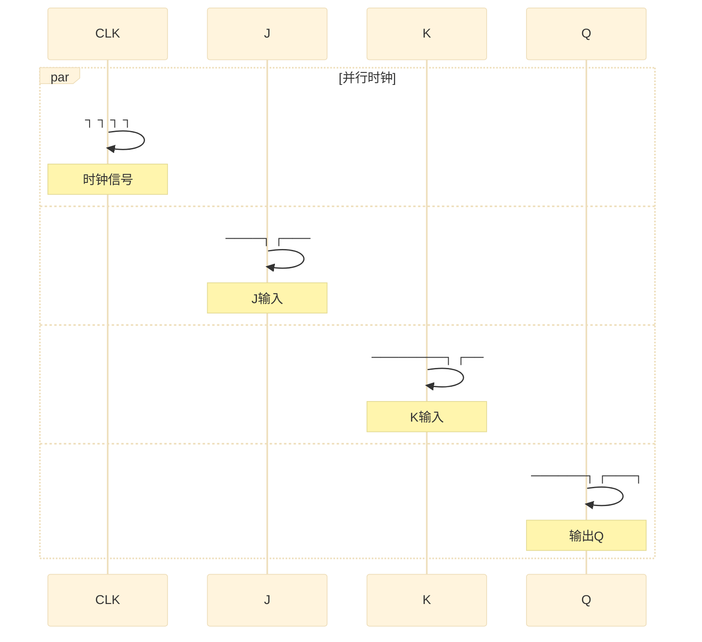
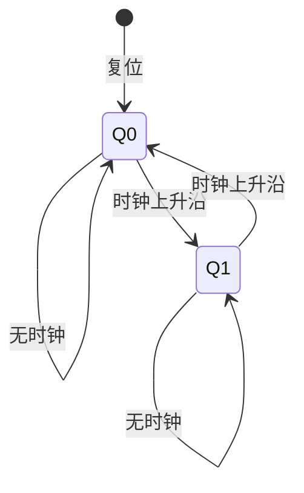
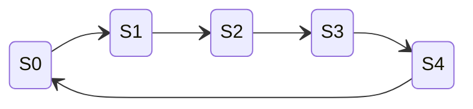
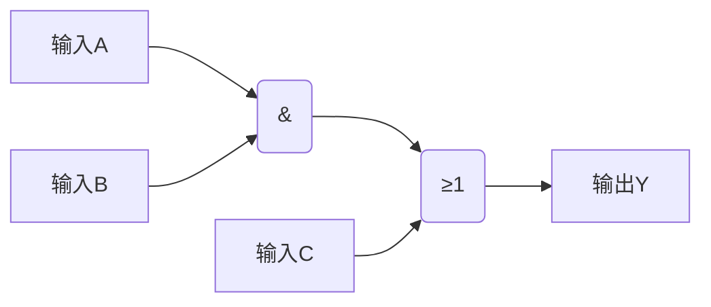
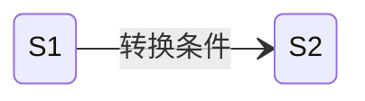

# Mermaid波形图指南 - 电子电路

> 822考试波形图绘制，使用Mermaid在Obsidian中预览

---

## 时序电路波形图

### 触发器时序图



### 计数器时序图

```mermaid
gantt
    title 4位二进制计数器时序
    dateFormat X
    axisFormat %L

    section 时钟
    CLK    :0, 1, 1, 1, 1, 1, 1, 1

    section 输出
    Q0     :0, 1, 0, 1, 0, 1, 0, 1
    Q1     :0, 0, 1, 1, 0, 0, 1, 1
    Q2     :0, 0, 0, 0, 1, 1, 1, 1
    Q3     :0, 0, 0, 0, 0, 0, 0, 0
```

### 移位寄存器时序图

```mermaid
gantt
    title 右移寄存器时序
    dateFormat X
    axisFormat %L

    section 输入
    DIN    :1, 0, 1, 1, 0, 1, 0, 0

    section 输出
    Q0     :0, 1, 0, 1, 1, 0, 1, 0
    Q1     :0, 0, 1, 0, 1, 1, 0, 1
    Q2     :0, 0, 0, 1, 0, 1, 1, 0
    Q3     :0, 0, 0, 0, 1, 0, 1, 1
```

---

## 模电波形图

### 滞回比较器波形

```mermaid
xychart-beta
    title "滞回比较器输入输出特性"
    x-axis "Ui(V)" [-5, -4, -3, -2, -1, 0, 1, 2, 3, 4, 5]
    y-axis "Uo(V)" [-15, -10, -5, 0, 5, 10, 15]
    line [0, 0, 0, 0, 0, 10, 10, 10, 10, 10, 10]
    line [10, 10, 10, 10, 10, -10, -10, -10, -10, -10, -10]
```

### 正弦波振荡波形

```mermaid
xychart-beta
    title "RC桥式振荡器输出波形"
    x-axis "t(ms)" [0, 1, 2, 3, 4, 5, 6, 7, 8, 9, 10]
    y-axis "Uo(V)" [-10, -5, 0, 5, 10]
    line [0, 5.9, 9.5, 9.5, 5.9, 0, -5.9, -9.5, -9.5, -5.9, 0]
```

### 方波发生器波形

```mermaid
gantt
    title 方波发生器时序
    dateFormat X
    axisFormat %L

    section 电容电压
    Uc     :0, 5, 10, 5, 0, 5, 10, 5, 0

    section 输出电压
    Uo     :10, 10, 10, -10, -10, -10, 10, 10, 10
```

---

## 状态转换图（State Diagram）

### 触发器状态转换



### 计数器状态转换



---

## 组合逻辑时序



---

## Obsidian预览说明

1. 安装 Mermaid 插件（Obsidian自带，无需安装）
2. 在编辑器中预览：Ctrl/Cmd + E
3. 或使用命令面板：输入 "Mermaid: Show preview"

⚠️ 注意：Mermaid语法在阅读模式下自动渲染

---

## Mermaid语法快速参考

### Gantt图表（用于时序波形）

```mermaid
gantt
    title 标题
    dateFormat X
    axisFormat %L

    section 信号名
    信号标签 :值1, 值2, 值3, 值4
```

### State Diagram（状态转换图）



### XY Chart（输入输出特性）

```mermaid
xychart-beta
    title "标题"
    x-axis "X轴名" [值列表]
    y-axis "Y轴名" [值列表]
    line [数据点列表]
```

⚠️ **考试应用**：这些Mermaid代码可以直接在Obsidian中预览，帮助理解时序关系和波形变化。
