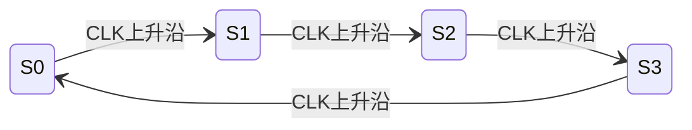

# SOP模板库 - 822电子技术基础

> 标准化解题流程，确保答题规范、完整

---

## 模电SOP模板

### SOP1: 共射放大电路分析

```markdown
## 步骤1: 计算静态工作点Q（康华光符号体系）

### 基极回路方程
$$
I_{BQ} = \frac{V_{CC} - U_{BEQ}}{R_b}
$$

### 集电极电流
$$
I_{CQ} = \beta I_{BQ}
$$

### 管压降
$$
U_{CEQ} = V_{CC} - I_{CQ} R_c
$$

### 检查放大区条件
$$
U_{CEQ} > U_{CES} \approx 0.3V
$$

⚠️ 注意使用Q下标表示静态值

## 步骤2: 计算动态参数
### 输入电阻
$$
r_{be} = r_{bb'} + (1+\beta)\frac{26}{I_{EQ}}
$$

### 电压增益
$$
A_u = -\frac{\beta R'_L}{r_{be}}
$$
其中：$R'_L = R_c // R_L$

### 输入电阻
$$
R_i = R_b // r_{be}
$$

### 输出电阻
$$
R_o = R_c
$$

## 步骤3: 频率响应分析
### 下限频率
$$
f_L = \frac{1}{2\pi(R_s + R_i)C_1}
$$

### 上限频率
$$
f_H = \frac{1}{2\pi r_{be}//r_{bb'} C_\pi}
$$

### 带宽
$$
BW = f_H - f_L
$$

## 步骤4: 波形失真分析
### 截止失真
$Q$点过低，$I_{BQ}$太小，负半周失真

### 饱和失真
$Q$点过高，$I_{BQ}$太大，正半周失真

## 答题检查清单
- [ ] 静态工作点使用Q下标（$I_{BQ}, I_{CQ}, U_{CEQ}$）
- [ ] $r_{be}$计算正确
- [ ] $R'_L$考虑了负载电阻
- [ ] 增益负号表示反相
- [ ] 检查了放大区条件
```

---

### SOP2: 共集/共基放大电路分析

```markdown
## 步骤1: 识别电路组态
- 共集：基极输入，发射极输出，集电极公共
- 共基：发射极输入，集电极输出，基极公共

## 步骤2: 计算静态工作点
[与共射电路类似]

## 步骤3: 计算动态参数

### 共集电路（射极跟随器）
$$
A_u = \frac{(1+\beta)R'_L}{r_{be} + (1+\beta)R'_L} \approx 1
$$
$$
R_i = R_b // [r_{be} + (1+\beta)R'_L]
$$
$$
R_o = R_e // \frac{r_{be} + R_s}{1+\beta}
$$

### 共基电路
$$
A_u = \frac{\beta R'_L}{r_{be}}
$$
$$
R_i = R_e // \frac{r_{be}}{1+\beta}
$$
$$
R_o = R_c
$$

## 步骤4: 总结特点
| 组态 | $A_u$ | $R_i$ | $R_o$ | 应用 |
|------|-------|-------|-------|------|
| 共射 | 大 | 中 | 大 | 主放大器 |
| 共集 | ≈1 | 大 | 小 | 缓冲器 |
| 共基 | 大 | 小 | 大 | 高频放大 |

## 答题检查清单
- [ ] 正确识别电路组态
- [ ] 静态工作点正确
- [ ] 动态参数公式选择正确
- [ ] 特点总结准确
```

---

### SOP3: 负反馈类型判断

```markdown
## 步骤1: 判断输出取样方式（电压/电流）
### 短路输出端法
- 短路输出端（$R_L=0$）
- 若反馈信号消失 → **电压反馈**
- 若反馈信号仍存在 → **电流反馈**

### 特征判断
| 电压反馈 | 电流反馈 |
|----------|----------|
| 反馈信号取自输出端 | 反馈信号取自非输出端 |
| 稳定输出电压 | 稳定输出电流 |
| $X_f \propto U_o$ | $X_f \propto I_o$ |

## 步骤2: 判断输入比较方式（串联/并联）
### 观察连接方式
- 反馈信号与输入信号串联 → **串联反馈**
- 反馈信号与输入信号并联 → **并联反馈**

### 特征判断
| 串联反馈 | 并联反馈 |
|----------|----------|
| 反馈加到发射极/源极 | 反馈加到基极/栅极 |
| $U_d = U_i - U_f$ | $I_d = I_i - I_f$ |
| $R_i$增大 | $R_i$减小 |

## 步骤3: 判断反馈极性（正/负）
### 瞬时极性法
1. 设输入信号瞬时极性为"+"
2. 沿信号传输路径逐级判断
3. 返回输入端：
   - 净输入减小 → **负反馈**
   - 净输入增大 → **正反馈**

## 步骤4: 计算深度负反馈增益
$$
A_{uf} \approx \frac{1}{F}
$$

### 四种组态增益
| 组态 | $A_{uf}$ |
|------|----------|
| 电压串联 | $\frac{U_o}{U_i}$ |
| 电压并联 | $\frac{U_o}{I_i}$ |
| 电流串联 | $\frac{I_o}{U_i}$ |
| 电流并联 | $\frac{I_o}{I_i}$ |

## 记忆口诀
```
电压反馈看输出：短路负载反馈无
电流反馈看输出：短路负载反馈留
串联反馈看输入：反馈信号串联入
并联反馈看输入：反馈信号并联入
```

## 答题检查清单
- [ ] 短路法判断输出取样
- [ ] 观察法判断输入比较
- [ ] 瞬时极性法判断极性
- [ ] 深度负反馈增益计算正确
- [ ] 反馈类型结论完整（4个词）
```

---

### SOP4: 差分放大电路分析

```markdown
## 步骤1: 识别电路类型
- 双入双出
- 双入单出
- 单入双出
- 单入单出

## 步骤2: 计算静态工作点
### 对称电路
$$
I_{C1} = I_{C2} = \frac{I_0}{2}
$$
$$
U_{C1} = U_{C2} = V_{CC} - I_C R_c
$$

## 步骤3: 计算动态参数

### 双入双出
$$
A_{ud} = -\frac{\beta R'_L}{2r_{be}}
$$
$$
A_{uc} \approx 0
$$
$$
K_{CMRR} \rightarrow \infty
$$

### 单端输出
$$
A_{ud} = \mp \frac{\beta R'_L}{2r_{be}}
$$
$$
A_{uc} = -\frac{\beta R'_L}{R_e + 2r_{be}}
$$
$$
K_{CMRR} = \left| \frac{A_{ud}}{A_{uc}} \right|
$$

### 输入输出电阻
$$
R_i = 2r_{be}
$$
$$
R_o = 2R_c \quad (\text{双端})
$$
$$
R_o = R_c \quad (\text{单端})
$$

## 步骤4: 分析共模抑制比
$$
K_{CMRR} = \left| \frac{A_{ud}}{A_{uc}} \right|
$$
或
$$
K_{CMRR(dB)} = 20\lg K_{CMRR}
$$

## 答题检查清单
- [ ] 正确识别电路类型
- [ ] 差模增益计算正确
- [ ] 共模增益计算正确
- [ ] 共模抑制比计算正确
- [ ] 输入输出电阻正确
```

---

### SOP5: 运算电路分析（增强版）

```markdown
## ⚠️ 步骤0: 工作区判断（必做！）

### 检查反馈类型
1. **存在负反馈** → 线性区 → **可使用虚短虚断**
2. **开环或正反馈** → 非线性区 → **禁止使用虚短**

### 判断流程
```
运放电路判断流程：
1. 检查输出端是否有反馈网络回到输入端
2. 判断反馈类型：
   - 负反馈：线性应用（比例、加法、减法、积分、微分、滤波）
   - 正反馈/开环：非线性应用（比较器、施密特触发器、振荡器）
3. 根据工作区选择分析方法
```

### 常见错误

| 电路类型 | 工作区 | 能用虚短？ | 常见错误 |
|----------|--------|-----------|----------|
| 反相比例放大 | 线性 | ✓ | 无 |
| 同相比例放大 | 线性 | ✓ | 无 |
| 加法运算电路 | 线性 | ✓ | 无 |
| 积分微分电路 | 线性 | ✓ | 无 |
| 有源滤波器 | 线性 | ✓ | 无 |
| **单限比较器** | **非线性** | **✗** | **误用虚短！** |
| **滞回比较器** | **非线性** | **✗** | **误用虚短！** |
| **方波发生器** | **非线性** | **✗** | **误用虚短！** |
| 矩形波发生器 | 非线性 | ✗ | 误用虚短 |

## 步骤1: 线性应用分析（负反馈电路）

### 虚短虚断条件
- **虚短**: $U_+ = U_-$（仅在负反馈时成立）
- **虚断**: $I_+ = I_- = 0$

### 节点电流方程
$$
\sum I_{in} = \sum I_{out}
$$

## 步骤2: 非线性应用分析（开环/正反馈电路）

### 比较器特性
- $U_+ > U_-$ 时：$U_o = +U_{sat}$
- $U_+ < U_-$ 时：$U_o = -U_{sat}$

### 滞回比较器
- 上下门限：$U_{TH+}, U_{TH-}$
- 传输特性滞回

### 滞回比较器波形（Mermaid）

输入输出特性：
```mermaid
xychart-beta
    title "滞回比较器传输特性"
    x-axis "Ui(V)" [-5, 0, 5]
    y-axis "Uo(V)" [-15, 0, 15]
    line [0, 0, 10]
    line [0, 0, -10]
```

⚠️ 该Mermaid代码可在Obsidian中直接渲染预览

## 答题检查清单
- [ ] ✅ **首先判断工作区**（最关键！）
- [ ] 线性区才用虚短虚断
- [ ] 非线性区用比较器特性
- [ ] 节点方程列写正确
- [ ] 量纲检查
```

---

### SOP6: 功率放大电路分析

```markdown
## 步骤1: 识别电路类型
- 甲类（Class A）
- 乙类（Class B）
- 甲乙类（Class AB）
- 丙类（Class C）

## 步骤2: 计算输出功率

### OCL电路（乙类）
$$
P_{om} = \frac{V_{CC}^2}{2R_L}
$$
$$
P_o = \frac{U_{om}^2}{2R_L}
$$

### OTL电路（乙类）
$$
P_{om} = \frac{V_{CC}^2}{8R_L}
$$

## 步骤3: 计算效率
$$
\eta = \frac{P_o}{P_V} \times 100\%
$$

### 乙类功放
$$
P_V = \frac{2V_{CC}}{\pi R_L}U_{om}
$$
$$
\eta_{max} = \frac{\pi}{4} \approx 78.5\%
$$

### 甲类功放
$$
\eta_{max} = 50\%
$$

### 甲乙类功放
$$
\eta_{max} \approx 60-70\%
$$

## 步骤4: 计算管耗
$$
P_T = P_V - P_o
$$
$$
P_{T1max} = \frac{V_{CC}^2}{\pi^2 R_L} \approx 0.2P_{om}
$$

## 步骤5: 分析失真
### 交越失真
- 乙类功放特有
- 消除方法：甲乙类偏置

## 答题检查清单
- [ ] 正确识别电路类型
- [ ] 输出功率计算正确
- [ ] 效率计算正确
- [ ] 管耗计算正确
- [ ] 失真分析正确
```

---

### SOP7: 波形产生电路分析

```markdown
## 步骤1: 识别电路类型
- RC振荡器（文氏桥、移相式）
- LC振荡器（电容三点、电感三点）
- 石英晶体振荡器

## 步骤2: 判断起振条件

### 幅值条件
$$
|AF| \geq 1
$$

### 相位条件
$$
\varphi_A + \varphi_F = 2n\pi \quad (n=0,1,2...)
$$

## 步骤3: 计算振荡频率

### 文氏桥振荡器
$$
f = \frac{1}{2\pi RC}
$$

### 电感三点式（哈特莱）
$$
f = \frac{1}{2\pi\sqrt{L_1 + L_2 + 2M}C}
$$

### 电容三点式（考毕兹）
$$
f = \frac{1}{2\pi\sqrt{L\frac{C_1C_2}{C_1 + C_2}}}
$$

### 石英晶体
$$
f = f_s = \frac{1}{2\pi\sqrt{LC}}
$$

## 步骤4: 分析稳幅措施
- 热敏电阻
- 二极管限幅
- 场效应管稳幅

## 步骤5: 非正弦波产生

### 矩形波/方波
- 使用滞回比较器
- 频率由RC充放电决定

### 三角波
- 积分器+比较器
- 线性充放电

## 答题检查清单
- [ ] 正确识别电路类型
- [ ] 起振条件判断正确
- [ ] 振荡频率计算正确
- [ ] 稳幅措施分析
- [ ] 波形绘制正确
```

---

### SOP8: 稳压电源分析

```markdown
## 步骤1: 识别电路结构
- 变压器 → 整流 → 滤波 → 稳压

## 步骤2: 整流电路分析

### 单相桥式整流
$$
U_o = 0.9U_2
$$
$$
U_{DRM} = \sqrt{2}U_2
$$
$$
I_D = \frac{1}{2}I_o
$$

## 步骤3: 滤波电路分析

### 电容滤波
$$
U_o \approx 1.2U_2
$$
$$
\tau = R_LC \geq (3-5)T
$$

## 步骤4: 稳压电路分析

### 串联型稳压电源
$$
U_o = \frac{R_1 + R_2}{R_2}(U_Z + U_{BE})
$$
$$
U_o \approx \frac{R_1 + R_2}{R_2}U_Z
$$

### 稳压系数
$$
S_r = \left.\frac{\Delta U_o/\Delta U_i}{U_o/U_i}\right|_{\Delta I_L=0}
$$

### 输出电阻
$$
R_o = \left.\frac{\Delta U_o}{\Delta I_L}\right|_{\Delta U_i=0}
$$

## 步骤5: 保护电路
- 限流保护
- 截止保护
- 过热保护

## 答题检查清单
- [ ] 电路结构分析正确
- [ ] 整流电路参数正确
- [ ] 滤波电路参数正确
- [ ] 稳压电路分析正确
- [ ] 稳压指标计算正确
```

---

## 数电SOP模板

### SOP9: 逻辑函数化简

```markdown
## 步骤1: 写出逻辑表达式
从真值表或逻辑图写出：
- 积之和形式（最小项之和）
- 和之积形式（最大项之积）

## 步骤2: 填写卡诺图

> ⚠️ **格式要求**: 所有卡诺图**必须**使用 Markdown 表格格式，**禁止**使用 ASCII 字符画

### 确定卡诺图规模
- 2变量：2×2
- 3变量：4×2
- 4变量：4×4
- 5变量：4×8（需折叠）

### 三变量卡诺图模板
|  | $BC=00$ | $BC=01$ | $BC=11$ | $BC=10$ |
|:---:|:---:|:---:|:---:|:---:|
| **$A=0$** | $m_0$ | $m_1$ | $m_3$ | $m_2$ |
| **$A=1$** | $m_4$ | $m_5$ | $m_7$ | $m_6$ |

### 四变量卡诺图模板
|  | $CD=00$ | $CD=01$ | $CD=11$ | $CD=10$ |
|:---:|:---:|:---:|:---:|:---:|
| **$AB=00$** | $m_0$ | $m_1$ | $m_3$ | $m_2$ |
| **$AB=01$** | $m_4$ | $m_5$ | $m_7$ | $m_6$ |
| **$AB=11$** | $m_{12}$ | $m_{13}$ | $m_{15}$ | $m_{14}$ |
| **$AB=10$** | $m_8$ | $m_9$ | $m_{11}$ | $m_{10}$ |

### 填值示例（含无关项）
|  | $BC=00$ | $BC=01$ | $BC=11$ | $BC=10$ |
|:---:|:---:|:---:|:---:|:---:|
| **$A=0$** | 1 | 0 | 1 | 1 |
| **$A=1$** | × | 0 | 1 | × |

> `×` 表示无关项（Don't Care）

### 格式要点
| 要点 | 说明 |
|------|------|
| 列编码 | 使用**格雷码**顺序：00, 01, 11, 10 |
| 下标 | 两位数下标用花括号：`$m_{12}$` |
| 对齐 | 全部使用居中对齐 `:---:` |
| 禁止 | ❌ 禁止使用 ASCII 字符画 |

## 步骤3: 圈组化简
### 圈组原则
1. 按$2^n$圈组（n=0,1,2,...）
2. 每个圈尽可能大
3. 圈的个数尽可能少
4. 每个1至少被圈一次
5. 允许重叠，但每个圈至少有一个独立1

### 无关项处理
- 无关项$\times$可以圈也可以不圈
- 对化简有利的就圈

## 步骤4: 写最简表达式
- 每个圈对应一个乘积项
- 所有圈相或
- 消去变化的变量，保留不变的变量

## 步骤5: 验证结果
- 与原表达式比较
- 用真值表验证

## 答题检查清单
- [ ] 逻辑表达式正确
- [ ] 卡诺图使用 Markdown 表格格式
- [ ] 卡诺图填写正确
- [ ] 圈组符合原则
- [ ] 最简表达式正确
- [ ] 验证无误
```

---

### SOP10: 组合逻辑电路分析

```markdown
## 步骤1: 分析电路结构
- 确定输入输出变量
- 识别逻辑门类型
- 明确信号流向

## 步骤2: 写逻辑表达式
从输入到输出逐级写：
$$
Y_1 = f_1(A,B,C...)
$$
$$
Y_2 = f_2(Y_1,...)
$$
$$
Y = f(Y_2,...)
$$

## 步骤3: 化简逻辑表达式
$$
Y = [化简后的表达式]
$$

## 步骤4: 列真值表
| A | B | C | ... | Y |
|---|---|---|-----|---|
| 0 | 0 | 0 | ... |   |
| 0 | 0 | 1 | ... |   |
| ... | ... | ... | ... | ... |

## 步骤5: 分析逻辑功能
描述电路实现的逻辑功能

## 步骤6: 画逻辑图
[用标准逻辑符号绘制]

## 答题检查清单
- [ ] 电路结构分析正确
- [ ] 逻辑表达式完整
- [ ] 化简正确
- [ ] 真值表正确
- [ ] 功能描述准确
```

---

### SOP11: 组合逻辑电路设计

```markdown
## 步骤1: 抽象逻辑问题
- 确定输入输出变量
- 定义逻辑状态（0/1的含义）

## 步骤2: 列真值表
根据逻辑要求列出真值表

## 步骤3: 写逻辑表达式
$$
Y = \sum m^N(...)
$$

## 步骤4: 化简逻辑表达式
用卡诺图或代数法化简

## 步骤5: 变换逻辑形式
根据指定门电路类型变换：
- 与非门实现
- 或非门实现
- 与或非门实现

### 与非门实现
$$
Y = \overline{\overline{Y}} = \overline{\overline{ABC...}}
$$

## 步骤6: 画逻辑图
[用指定门电路绘制]

## 答题检查清单
- [ ] 抽象正确
- [ ] 真值表完整
- [ ] 表达式正确
- [ ] 化简正确
- [ ] 逻辑图规范
```

---

### SOP12: 时序逻辑电路分析

```markdown
## 步骤1: 分析电路结构
- 确定触发器类型和个数
- 识别组合逻辑部分
- 明确输入输出

## 步骤2: 写驱动方程
从电路图写出各触发器的输入方程：
$$
J_1 = f_1(X, Q), \quad K_1 = g_1(X, Q)
$$
$$
J_2 = f_2(X, Q), \quad K_2 = g_2(X, Q)
$$
...

## 步骤3: 写状态方程
将驱动方程代入触发器特性方程：
$$
Q_1^{n+1} = J_1Q_1^n + \overline{K_1}Q_1^n
$$
$$
Q_2^{n+1} = J_2Q_2^n + \overline{K_2}Q_2^n
$$
...

## 步骤4: 写输出方程
$$
Y = f(Q^n, X)
$$

## 步骤5: 列状态转换表
| $X$ | $Q_2^n Q_1^n$ | $Q_2^{n+1} Q_1^{n+1}$ | $Y$ |
|-----|--------------|---------------------|-----|
| 0 | 00 | ... | ... |
| 0 | 01 | ... | ... |
| ... | ... | ... | ... |

## 步骤6: 画状态转换图
```
[状态转换图]
```

### Mermaid状态转换图模板



⚠️ 该Mermaid代码可在Obsidian中直接渲染预览

## 步骤7: 生成Mermaid时序图（可选）

### 时序图模板

```mermaid
gantt
    title 时序逻辑电路波形
    dateFormat X
    axisFormat %L

    section 时钟
    CLK    :0, 1, 0, 1, 0, 1, 0, 1

    section 输出
    Q0     :0, 0, 1, 1, 0, 0, 1, 1
    Q1     :0, 0, 0, 0, 1, 1, 1, 1
```

⚠️ 该Mermaid代码可在Obsidian中直接渲染预览

## 步骤8: 检查自启动
列出所有无效状态，检查能否进入有效循环

## 步骤9: 分析逻辑功能
描述电路实现的逻辑功能

## 答题检查清单
- [ ] 驱动方程正确
- [ ] 状态方程正确
- [ ] 输出方程正确
- [ ] 状态转换表正确
- [ ] 状态转换图正确
- [ ] 自启动检查
- [ ] 功能描述准确
```

---

### SOP13: 时序逻辑电路设计

```markdown
## 步骤1: 抽象逻辑问题
- 确定输入输出
- 定义状态含义
- 画出原始状态图

## 步骤2: 状态化简
合并等价状态，求最简状态图

## 步骤3: 状态分配
给每个状态分配二进制编码
- 状态数$N$与触发器数$n$的关系：$2^{n-1} < N \leq 2^n$

## 步骤4: 选触发器类型
- JK触发器：功能最全
- D触发器：设计简单
- T触发器：适合计数

## 步骤5: 列状态转换表
根据设计要求列出状态转换表

## 步骤6: 求驱动方程
用卡诺图化简各触发器的驱动方程：
$$
J_1 = f(Q^n, X), \quad K_1 = g(Q^n, X)
$$

## 步骤7: 求输出方程
$$
Y = f(Q^n, X)
$$

## 步骤8: 检查自启动
检查无效状态的转换

## 步骤9: 画逻辑图
[用逻辑符号绘制电路图]

## 答题检查清单
- [ ] 抽象正确
- [ ] 状态分配合理
- [ ] 驱动方程正确
- [ ] 输出方程正确
- [ ] 自启动检查
- [ ] 逻辑图规范
```

---

### SOP14: 计数器分析

```markdown
## 步骤1: 识别计数器类型
- 同步/异步
- 加法/减法/可逆
- 二进制/十进制/任意进制

## 步骤2: 分析工作原理
### 异步计数器
- 时钟连接方式
- 逐级触发原理

### 同步计数器
- 公共时钟
- 驱动方程

## 步骤3: 列状态转换表
| $Q_n$ | ... | $Q_1$ | $Q_0$ | 功能 |
|-------|-----|-------|-------|------|
| 0 | ... | 0 | 0 | 0 |
| 0 | ... | 0 | 1 | 1 |
| ... | ... | ... | ... | ... |

## 步骤4: 画时序图
```
[时序波形图]
```

## 步骤5: 分析模数
$$
M = [计数循环中的状态数]
$$

## 步骤6: 检查自启动
列出无效状态，检查转换

## 答题检查清单
- [ ] 类型识别正确
- [ ] 工作原理分析正确
- [ ] 状态转换表正确
- [ ] 时序图正确
- [ ] 模数正确
- [ ] 自启动检查
```

---

### SOP15: 计数器设计

```markdown
## 步骤1: 确定设计要求
- 计数模数$N$
- 计数方式（加/减/可逆）
- 编码方式（二进制/BCD等）

## 步骤2: 选计数器芯片
- 74LS161：4位二进制同步计数器
- 74LS160：4位十进制同步计数器
- 74LS290：二-五-十进制异步计数器

## 步骤3: 确定设计方法
### 置数法
利用置数端跳过无效状态：
$$
\text{置数值} = 2^n - N
$$

### 复位法
利用清零端跳过无效状态：
$$
\text{复位值} = N
$$

## 步骤4: 列状态转换表
列出有效状态循环

## 步骤5: 设计反馈电路
### 置数法
检测最后一个状态，产生置数信号

### 复位法
检测第一个无效状态，产生清零信号

## 步骤6: 画逻辑图
```
[计数器逻辑图]
```

## 步骤7: 检查自启动
确认设计可靠

## 答题检查清单
- [ ] 设计要求明确
- [ ] 芯片选择正确
- [ ] 设计方法正确
- [ ] 状态转换表正确
- [ ] 反馈电路正确
- [ ] 逻辑图规范
- [ ] 自启动可靠
```

---

### SOP16: 移位寄存器应用

```markdown
## 步骤1: 识别移位寄存器类型
- 单向移位（左移/右移）
- 双向移位
- 循环移位

## 步骤2: 分析工作原理
### 移位操作
$$
Q_i^{n+1} = Q_{i-1}^n \quad (\text{右移})
$$
$$
Q_i^{n+1} = Q_{i+1}^n \quad (\text{左移})
$$

### 并行置数
$$
Q_i = D_i
$$

## 步骤3: 列状态转换表
| CLK | $Q_3$ | $Q_2$ | $Q_1$ | $Q_0$ | 功能 |
|-----|-------|-------|-------|-------|------|
| 0 | ... | ... | ... | ... | 初始 |
| 1 | ... | ... | ... | ... | 移位 |
| ... | ... | ... | ... | ... | ... |

## 步骤4: 分析应用
### 移位寄存型计数器
- 环形计数器
- 扭环形计数器

### 序列信号发生器
$$
D_0 = f(Q_3, Q_2, Q_1)
$$

### 串并转换
- 串行输入→并行输出
- 并行输入→串行输出

## 答题检查清单
- [ ] 类型识别正确
- [ ] 工作原理分析正确
- [ ] 状态转换表正确
- [ ] 应用分析正确
```

---

### SOP17: ADC/DAC转换器

```markdown
## 步骤1: 识别转换器类型

### DAC类型
- 权电阻型
- 倒T型电阻网络
- 权电流型

### ADC类型
- 并行比较型
- 逐次逼近型
- 双积分型

## 步骤2: 计算DAC输出

### 倒T型电阻网络DAC
$$
U_o = -\frac{U_{REF}}{2^n}\sum_{i=0}^{n-1} D_i 2^i
$$

### 分辨率
$$
Resolution = \frac{U_{REF}}{2^n}
$$

## 步骤3: 分析ADC转换

### 转换时间
- 并行比较型：最快
- 逐次逼近型：中等
- 双积分型：最慢

### 转换精度
- 量化误差：$\pm \frac{1}{2}LSB$
- 分辨率：$n$位

### 量化
$$
U_{LSB} = \frac{U_{REF}}{2^n}
$$

## 步骤4: 计算输出代码
$$
D = \text{round}\left(\frac{U_i}{U_{REF}} \times 2^n\right)
$$

## 步骤5: 分析性能参数
- 分辨率
- 转换精度
- 转换速度
- 输入电压范围

## 答题检查清单
- [ ] 类型识别正确
- [ ] DAC输出计算正确
- [ ] ADC转换分析正确
- [ ] 分辨率计算正确
- [ ] 性能参数分析正确
```

---

## 使用说明

1. **选择SOP**：根据题目类型选择对应SOP
2. **按步骤执行**：严格按照SOP步骤执行
3. **检查清单**：使用检查清单验证完整性
4. **灵活调整**：根据具体题目灵活调整SOP

---

## SOP快速索引

| SOP编号 | 名称 | 类型 | 触发关键词 |
|---------|------|------|------------|
| SOP1 | 共射放大电路分析 | 模电 | 共射、放大电路、$A_u$ |
| SOP2 | 共集/共基分析 | 模电 | 射极跟随器、共基 |
| SOP3 | 负反馈类型判断 | 模电 | 反馈类型、深度负反馈 |
| SOP4 | 差分放大电路分析 | 模电 | 差分、共模抑制比 |
| SOP5 | 运算电路分析 | 模电 | 运放、虚短虚断 |
| SOP6 | 功率放大电路分析 | 模电 | 功放、效率、OCL |
| SOP7 | 波形产生电路分析 | 模电 | 振荡器、起振条件 |
| SOP8 | 稳压电源分析 | 模电 | 稳压电源、整流滤波 |
| SOP9 | 逻辑函数化简 | 数电 | 卡诺图、化简 |
| SOP10 | 组合逻辑电路分析 | 数电 | 分析组合逻辑 |
| SOP11 | 组合逻辑电路设计 | 数电 | 设计组合逻辑 |
| SOP12 | 时序逻辑电路分析 | 数电 | 分析时序逻辑 |
| SOP13 | 时序逻辑电路设计 | 数电 | 设计时序逻辑 |
| SOP14 | 计数器分析 | 数电 | 分析计数器 |
| SOP15 | 计数器设计 | 数电 | 设计计数器 |
| SOP16 | 移位寄存器应用 | 数电 | 移位寄存器 |
| SOP17 | ADC/DAC转换器 | 数电 | ADC、DAC、转换器 |
